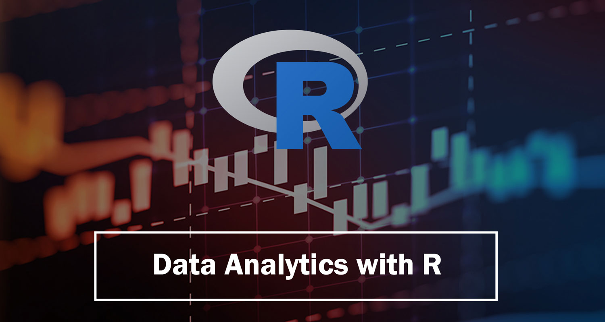

# R Statistical Modeling




---

## 🇧🇷 R Statistical Modeling (Português)

Suite avançada de modelagem estatística em R para análise de dados, machine learning, séries temporais e métodos bayesianos com visualizações interativas e relatórios automatizados.

### 🎯 Visão Geral

Plataforma completa de análise estatística que demonstra competências avançadas em R para modelagem estatística, análise de dados, machine learning e visualização de dados científicos.

### ✨ Características Principais

- **📊 Modelagem Estatística**: Regressão, GLM, modelos mistos
- **🔮 Séries Temporais**: ARIMA, GARCH, forecasting
- **🤖 Machine Learning**: Random Forest, SVM, clustering
- **📈 Visualizações**: ggplot2, plotly, dashboards interativos
- **📋 Relatórios**: R Markdown, documentos dinâmicos
- **🧪 Testes Estatísticos**: Hipóteses, ANOVA, testes não-paramétricos

---

## 🇬🇧 R Statistical Modeling (English)

Advanced suite of statistical modeling in R for data analysis, machine learning, time series, and Bayesian methods with interactive visualizations and automated reports.

### 🎯 Overview

A complete statistical analysis platform that demonstrates advanced skills in R for statistical modeling, data analysis, machine learning, and scientific data visualization.

### ✨ Key Features

- **📊 Statistical Modeling**: Regression, GLM, mixed models
- **🔮 Time Series**: ARIMA, GARCH, forecasting
- **🤖 Machine Learning**: Random Forest, SVM, clustering
- **📈 Visualizations**: ggplot2, plotly, interactive dashboards
- **📋 Reports**: R Markdown, dynamic documents
- **🧪 Statistical Tests**: Hypotheses, ANOVA, non-parametric tests

---

## 🛠️ Tech Stack

### Core R Packages
- **R 4.3+**: Statistical computing language
- **RStudio**: Integrated IDE for development
- **tidyverse**: Set of packages for data science
- **ggplot2**: Grammar of graphics for visualizations

### Modeling and Analysis
- **caret**: Classification and regression training
- **randomForest**: Random forest algorithms
- **e1071**: SVM and statistical methods
- **forecast**: Time series analysis
- **MASS**: Statistical functions and datasets

### Visualization and Interface
- **shiny**: Interactive web applications
- **plotly**: Interactive graphics
- **DT**: Interactive tables
- **shinydashboard**: Professional dashboards

## 📁 Project Structure

```
R-Statistical-Modeling/
├── src/                           # Organized R scripts
│   ├── data_preprocessing.R       # Preprocessing
│   ├── statistical_models.R       # Statistical models
│   ├── machine_learning.R         # ML algorithms
│   ├── time_series.R              # Temporal analysis
│   ├── visualization.R            # Visualizations
│   └── utils.R                    # Utility functions
├── data/                          # Datasets
│   ├── raw/                       # Raw data
│   ├── processed/                 # Processed data
│   └── examples/                  # Example data
├── reports/                       # R Markdown reports
│   ├── analysis_report.Rmd        # Main report
│   ├── model_comparison.Rmd       # Model comparison
│   └── time_series_analysis.Rmd   # Temporal analysis
├── shiny_apps/                    # Shiny applications
│   ├── statistical_dashboard/     # Main dashboard
│   ├── model_explorer/            # Model explorer
│   └── data_visualizer/           # Data visualizer
├── tests/                         # Automated tests
├── docs/                          # Documentation
├── main.R                         # Main script
├── .gitignore                     # Ignored files
└── README.md                      # Documentation
```

## 🚀 Quick Start

### Prerequisites

- R 4.3+
- RStudio (recommended)
- Rtools (Windows)

### Installation

1. **Clone the repository:**
```bash
git clone https://github.com/galafis/R-Statistical-Modeling.git
cd R-Statistical-Modeling
```

2. **Install the necessary packages:**
```r
# Install main packages
install.packages(c(
  "tidyverse", "ggplot2", "dplyr", "shiny", "plotly",
  "caret", "randomForest", "e1071", "forecast",
  "rmarkdown", "DT", "shinydashboard", "MASS"
))
```

3. **Run the main script:**
```r
source("main.R")
```

4. **Launch the Shiny application:**
```r
shiny::runApp("shiny_apps/statistical_dashboard")
```

## 📄 License

This project is licensed under the MIT License - see the [LICENSE](LICENSE) file for details.

## 👨‍💻 Author

**Gabriel Demetrios Lafis**

- GitHub: [@galafis](https://github.com/galafis)
- Email: gabrieldemetrios@gmail.com

---

⭐ If this project was helpful, consider leaving a star!

